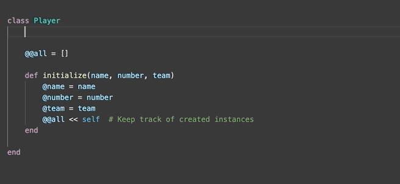

# ruby_macros

<p align="center">
  
</p>

### Overview
This is a lightweight repo demonstrating how ruby macros (i.e. class methods that dynamically generate instance methods) work! Macros pop up frequently in ruby applications. A couple of common examples are: 
* Built-in instance attribute reader/writer methods (`attr_reader`, `attr_writer` and `attr_accessor`)
* [ActiveRecord Associations](https://guides.rubyonrails.org/association_basics.html) (the Rails model layer).

It's useful to understand how they work, and acknowledge that they're not magic, they're plain old ruby! For a detailed explanation, check out [my blog post](https://medium.com/@ellisandrews1/ruby-macros-18bb67e051c7) on the subject.

### Setup
```
$ bundle install
```

### Execution
_Option 1_
```
$ ruby example.rb
```
Executing this script will print some output demonstrating that the macro-created instances methods work.

_Option 2_
```
$ ruby sandbox.rb
```
Executing this script will dump you in a `binding.pry` session, where you'll have access to play with the objects created in the `seeds.rb` file, and test out the macro-created methods for yourself interactively!

### Extending
Feel free to create your own macros, and load them into the `CustomMacroBase` class from which the models inhereit!
